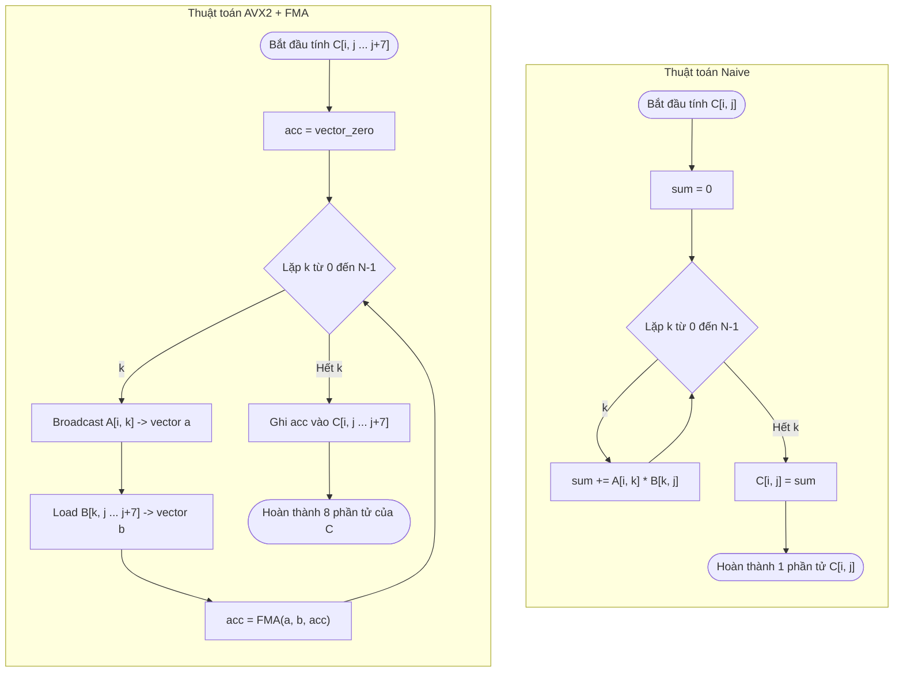

# Mô Phỏng Nhân Ma Trận: Naive vs AVX2 (FMA)

Tài liệu này mô phỏng trực quan cách thức hoạt động của thuật toán nhân ma trận thông thường (Naive) và thuật toán tối ưu hóa sử dụng vector hóa AVX2 (Advanced Vector Extensions 2) cùng với FMA (Fused Multiply-Accumulate).

---

## 1. Thuật Toán Naive Matmul (Vô hướng - Scalar)

Trong thuật toán Naive, chúng ta tính toán **từng phần tử đơn lẻ** $C[i, j]$ của ma trận kết quả $C$ tại mỗi thời điểm.

### Mô phỏng luồng dữ liệu

Để tính toán một phần tử $C[i, j]$, thuật toán thực hiện quét toàn bộ **Hàng $i$ của ma trận $A$** và **Cột $j$ của ma trận $B$**:

```
            Ma trận A (Hàng i)                  Ma trận B (Cột j)
         k=0    k=1          k=N-1                 Cột j
       ┌─────┬─────┬───┬─────┐                 ┌─────┐  k=0
Hàng i │ A0  │ A1  │...│ An-1│              k=0│ B0  │
       └─────┴─────┴───┴─────┘                 ├─────┤  k=1
                                            k=1│ B1  │
                                               ├─────┤
                                               │...  │
                                               ├─────┤
                                          k=N-1│ Bn-1│
                                               └─────┘
                                                  │
                                                  ▼
     Phép tính: Sum = (A0 * B0) + (A1 * B1) + ... + (An-1 * Bn-1)
                                                  │
                                                  ▼
                                         Ma trận C (Kết quả)
                                               Cột j
                                           ┌───┬───┬───┐
                                           │   │   │   │
                                    Hàng i ├───┼───┼───┤
                                           │   │Sum│   │  <── Ghi nhận 1 giá trị đơn lẻ
                                           └───┴───┴───┘
```

### Ưu/Nhược điểm của Naive
* **Ưu điểm**: Đơn giản, dễ viết.
* **Nhược điểm**: 
  * **Bộ nhớ cache không tối ưu**: Việc truy cập ma trận B theo cột (`B[k * N + j]`) dẫn đến hiện tượng nhảy dòng bộ nhớ (non-stride-1 memory access), gây Cache Miss rất nhiều.
  * **Hiệu năng kém**: CPU chỉ thực hiện tính toán vô hướng (1 phép nhân + 1 phép cộng tại một thời điểm trên một vùng ALU vô hướng).

---

## 2. Thuật Toán AVX2 + FMA Matmul (Vector hóa)

AVX2 sử dụng các thanh ghi rộng **256-bit** để tính toán song song trên **8 số thực float (32-bit)** cùng một lúc. Thay vì đi theo từng cột của B, thuật toán này đi theo từng dòng của B giúp tận dụng bộ nhớ đệm (Cache Line) cực tốt.

Trong mỗi bước của vòng lặp, ta tính toán đồng thời cho **8 phần tử** từ $C[i, j]$ đến $C[i, j+7]$.

### Luồng xử lý trong thanh ghi Vector (256-bit)

Ở mỗi bước của vòng lặp trung gian $k$:

1. **Broadcast $A[i, k]$**: Phần tử đơn lẻ $A[i,k]$ được nhân bản làm 8 bản sao vào thanh ghi `__m256 a`.
2. **Load 8 phần tử B**: Tải 8 phần tử liên tiếp từ hàng $k$ của ma trận B (từ cột $j$ đến $j+7$) vào thanh ghi `__m256 b`.
3. **FMA (Fused Multiply-Accumulate)**: Nhân song song 8 cặp phần tử này và cộng trực tiếp vào thanh ghi tích lũy `acc`.

```
Bước k:
  [ Thao tác 1: Broadcast A[i,k] ]
  A[i,k]  ──►  ┌───────┬───────┬───────┬───────┬───────┬───────┬───────┬───────┐
               │A[i,k] │A[i,k] │A[i,k] │A[i,k] │A[i,k] │A[i,k] │A[i,k] │A[i,k] │  <── Thanh ghi `a` (256-bit)
               └───────┴───────┴───────┴───────┴───────┴───────┴───────┴───────┘
                                   * (Nhân song song 8 phần tử)
  [ Thao tác 2: Load 8 phần tử liên tiếp từ hàng k của B ]
  B hàng k ──► ┌───────┬───────┬───────┬───────┬───────┬───────┬───────┬───────┐
               │B[k,j] │B[k,j1]│B[k,j2]│B[k,j3]│B[k,j4]│B[k,j5]│B[k,j6]│B[k,j7]│  <── Thanh ghi `b` (256-bit)
               └───────┴───────┴───────┴───────┴───────┴───────┴───────┴───────┘
                                   + (Cộng song song vào thanh ghi tích lũy)
  [ Thao tác 3: FMA vào thanh ghi tích lũy `acc` ]
  acc      ──► ┌───────┬───────┬───────┬───────┬───────┬───────┬───────┬───────┐
               │ acc0  │ acc1  │ acc2  │ acc3  │ acc4  │ acc5  │ acc6  │ acc7  │  <── Thanh ghi `acc` (256-bit)
               └───────┴───────┴───────┴───────┴───────┴───────┴───────┴───────┘
```

Sau khi chạy hết vòng lặp theo $k$ (từ $0$ đến $N-1$), thanh ghi `acc` chứa kết quả hoàn chỉnh của 8 phần tử ma trận C. Ta thực hiện ghi toàn bộ 8 phần tử này xuống bộ nhớ:

```
  [ Thao tác 4: Store 8 kết quả từ `acc` xuống Ma trận C ]
  Thanh ghi `acc`
  ┌───────┬───────┬───────┬───────┬───────┬───────┬───────┬───────┐
  │ acc0  │ acc1  │ acc2  │ acc3  │ acc4  │ acc5  │ acc6  │ acc7  │
  └───────┴───────┴───────┴───────┴───────┴───────┴───────┴───────┘
      │       │       │       │       │       │       │       │
      ▼       ▼       ▼       ▼       ▼       ▼       ▼       ▼
  ┌───────┬───────┬───────┬───────┬───────┬───────┬───────┬───────┐
  │C[i,j] │C[i,j1]│C[i,j2]│C[i,j3]│C[i,j4]│C[i,j5]│C[i,j6]│C[i,j7]│  <── Ghi vào Ma trận C (Hàng i, Cột j -> j+7)
  └───────┴───────┴───────┴───────┴───────┴───────┴───────┴───────┘
```

### Sơ đồ luồng hoạt động tổng quát (Mermaid)

Sơ đồ dưới đây thể hiện luồng xử lý bên trong một bước lặp chính của hai thuật toán:



### Vì sao AVX2 nhanh hơn vượt trội?
1. **Tính song song cao**: Thay vì thực hiện $8$ phép nhân và $8$ phép cộng vô hướng riêng biệt, AVX2 cùng FMA thực hiện toàn bộ chỉ bằng $1$ lệnh hợp ngữ duy nhất (`vfmadd213ps` hoặc tương đương) trên 8 luồng dữ liệu song song (SIMD - Single Instruction Multiple Data).
2. **Thân thiện với Cache**: Khi load $B[k, j \dots j+7]$, bộ nhớ được đọc một cách liên tục (stride-1). Điều này giúp CPU tận dụng tối đa cơ chế nạp trước của bộ nhớ đệm (Hardware Prefetcher) và giảm thiểu tối đa Cache Miss.
