# AI Compiler vs Traditional Compiler

## 1. Mở đầu
Trong lĩnh vực phát triển phần mềm, trình biên dịch (compiler) truyền thống như GCC hay Clang đã tồn tại và phát triển hàng thập kỷ, đóng vai trò chuyển đổi mã nguồn (C/C++, Rust) thành mã máy cho CPU. Tuy nhiên, sự bùng nổ của Deep Learning với các mô hình khổng lồ và phần cứng chuyên biệt (GPU, TPU, NPU) đòi hỏi một thế hệ trình biên dịch mới: **AI Compiler** (như XLA, TVM, Triton). 

Việc so sánh giữa AI Compiler và Traditional Compiler giúp các kỹ sư ML hiểu rõ cốt lõi của công nghệ, nhận ra những nguyên lý nền tảng nào được tái sử dụng và những kiến trúc nào phải thay đổi hoàn toàn để giải quyết bài toán tính toán cường độ cao trên Tensor.

## 2. Pipeline so sánh

Sự khác biệt lớn đầu tiên nằm ở luồng xử lý (pipeline) từ đầu vào đến đầu ra:

```mermaid
graph TD
    subgraph Traditional Compiler
    A1[Source Code] --> B1[Lexer/Parser]
    B1 --> C1[AST]
    C1 --> D1[Semantic Analysis]
    D1 --> E1[IR Generation]
    E1 --> F1[Optimization Passes]
    F1 --> G1[Instruction Selection]
    G1 --> H1[Register Allocation]
    H1 --> I1[Scheduling]
    I1 --> J1[Machine Code]
    end

    subgraph AI Compiler
    A2[PyTorch/JAX Model] --> B2[Graph Capture / Tracing]
    B2 --> C2[Graph IR]
    C2 --> D2[Graph Optimizations<br/>Fusion, Const Fold]
    D2 --> E2[Tensor IR]
    E2 --> F2[Tiling / Scheduling]
    F2 --> G2[Auto-tuning]
    G2 --> H2[Codegen<br/>PTX / LLVM / Custom ISA]
    end
```

## 3. Bảng so sánh chi tiết

Dưới đây là bảng phân tích sâu các chiều không gian (dimensions) khác biệt:

| Đặc điểm | Traditional Compiler (C/C++, Rust) | AI Compiler (XLA, TVM, Triton) |
| :--- | :--- | :--- |
| **Đơn vị tối ưu** | Biến vô hướng (Scalar), vòng lặp (Loop) | Toán tử Tensor (Tensor op), Đồ thị (Graph) |
| **Input representation** | Mã nguồn dạng Text (Textual Source Code) | Đồ thị tính toán từ Python runtime (Graph) |
| **IR design philosophy** | Single/Few levels (như LLVM IR) | Multi-level IR (như MLIR với nhiều Dialect) |
| **Analysis chính** | Alias analysis, Data-flow analysis | Layout/memory planning, Shape/Type analysis |
| **Optimization passes chính** | Inlining, Loop unrolling, Vectorization | Operator fusion, Layout transformation, Quantization |
| **Memory management philosophy** | Hardware tự quản lý (Cache hierarchy) | Compiler chủ động quản lý (Scratchpad, Shared Memory) |
| **Codegen targets** | 1 ISA cố định (x86, ARM) | Đa dạng accelerator (NVIDIA GPU, AMD GPU, TPU, NPU) |
| **Autotuning role** | Ít, chủ yếu qua PGO (Profile-Guided Opt) | Rất nhiều, Search-based (như TVM MetaSchedule) |
| **Compilation model** | Thường là AOT (Ahead-of-Time) | JIT (Just-in-Time) thường xuyên, hoặc AOT cho deploy |
| **Typical compile time** | Nhanh (giây đến phút) | Chậm do Auto-tuning (phút đến hàng giờ) |

## 4. Những gì AI compiler KẾ THỪA từ traditional compiler

Dù giải quyết bài toán khác nhau, AI compiler vẫn được xây dựng trên nền tảng của compiler truyền thống:

*   **SSA form (Static Single Assignment):** Cả LLVM IR và hầu hết các Dialect của MLIR đều dùng cấu trúc SSA để đơn giản hóa quá trình phân tích và tối ưu hóa luồng dữ liệu.
*   **Pass infrastructure:** Kiến trúc duyệt qua IR và áp dụng các tối ưu tuần tự (PassManager) hoàn toàn giống nhau.
*   **Các tối ưu kinh điển:** Constant folding, Dead Code Elimination (DCE), Common Subexpression Elimination (CSE) vẫn tồn tại. Tuy nhiên, chúng hoạt động trên mức độ hạt (granularity) khác nhau: thao tác trên cả một Tensor khổng lồ thay vì các số nguyên vô hướng.
*   **Pattern matching:** Kỹ thuật khớp mẫu (Pattern matching) dùng để Instruction Selection trong LLVM cũng được dùng trong AI Compiler để gom nhóm toán tử (Fusion) hoặc mapping xuống các thư viện có sẵn (như cuBLAS).
*   **IR design principles:** Nguyên lý thiết kế nhiều tầng trừu tượng (multiple levels of abstraction) vẫn được giữ vững và thậm chí phát huy tối đa với MLIR.

## 5. Những gì AI compiler VỨT BỎ hoặc THAY ĐỔI

Do nhắm đến phần cứng song song ồ ạt, nhiều phase kinh điển không còn hoặc bị thay đổi bản chất:

*   **Register allocation:** Không còn là mối bận tâm hàng đầu ở mức Graph/Tensor IR. Với GPU và các bộ tăng tốc, phần cứng quản lý register theo các thread/warp, compiler phần lớn nhường lại việc này cho backend (như ptxas).
*   **Alias analysis:** Trong C/C++, con trỏ làm cho việc phân tích vùng nhớ cực kỳ phức tạp. Trong AI Compiler, các Tensor thường là immutable (không thay đổi) hoặc có ngữ nghĩa vùng nhớ rõ ràng (no-alias by default), nên Alias Analysis được thay thế bằng Tensor lifetime analysis và Buffer allocation.
*   **Scalar optimizations:** Không còn là trọng tâm. Vòng lặp for trên các mảng 1D được thay thế bằng các toán tử ma trận (Matmul, Conv2D).
*   **Single ISA target:** Thay vì sinh mã máy trực tiếp cho x86, AI compiler thường sinh ra mã nguồn bậc trung như C++, CUDA C, PTX hoặc LLVM IR, sau đó gọi các compiler khác xử lý tiếp.
*   **Parsing text:** Bước Lexer/Parser thường không có, thay vào đó là "Graph Capture" (như `torch.compile` hoặc JAX `jax.jit`) trích xuất đồ thị trực tiếp từ quá trình chạy Python.

## 6. Những gì AI compiler THÊM MỚI

Để vắt kiệt hiệu năng của phần cứng AI, AI Compiler đưa vào nhiều khái niệm chưa từng có ở compiler truyền thống:

*   **Op fusion:** Tối ưu cực kỳ quan trọng giúp giảm thiểu việc đọc/ghi từ bộ nhớ HBM chậm chạp, vượt qua rào cản băng thông ("Memory Wall").
*   **Tiling for hardware units:** Kỹ thuật chia nhỏ ma trận (Tiling) để vừa vặn với các bộ đệm và đơn vị phần cứng đặc biệt như Systolic Arrays (TPU) hay Tensor Cores (GPU).
*   **Layout optimization:** Tối ưu hóa cách sắp xếp dữ liệu trong bộ nhớ (NCHW chuyển sang NHWC, hoặc các layout dạng block riêng cho từng loại kiến trúc).
*   **Auto-tuning / Search-based optimization:** Sử dụng Machine Learning, thuật toán di truyền hoặc tìm kiếm để tự động sinh ra lịch trình (schedule) tốt nhất cho một toán tử trên một phần cứng cụ thể, thay vì dùng các heuristic tĩnh.
*   **Quantization passes:** Tự động chuyển đổi các phép tính từ số thực dấu phẩy động (FP32) xuống số nguyên (INT8) hoặc FP16/BF16 để tăng tốc mà vẫn giữ được độ chính xác.
*   **Multi-level IR (MLIR):** Biến đổi chương trình dần dần qua rất nhiều tầng Dialect (từ Graph -> Linalg -> Affine -> Vector -> LLVM/SPIR-V) (Progressive lowering).
*   **Graph-level optimizations:** Lập lịch các toán tử toàn cục và quy hoạch vùng nhớ cho cả quá trình suy luận.

## 7. Liên hệ thực tế (ToyCalc Compiler)

Nhìn lại trình biên dịch ToyCalc bạn đã xây dựng trong quá trình học:

*   **Constant folding trong ToyCalc:** Cùng một khái niệm với XLA constant folding, nhưng thay vì các hằng số vô hướng, AI compiler gộp các Tensor hằng số.
*   **DCE (Dead Code Elimination) trong ToyCalc:** Tương tự, nếu một Tensor không đóng góp vào Output cuối cùng, AI Compiler sẽ vứt bỏ toàn bộ đường tính toán đó ở một quy mô lớn hơn (Tensor-level).
*   **Stack machine VM:** Cỗ máy ảo của ToyCalc tương đương với việc "Kernel Launch" trên GPU. Đều là một luồng thực thi (execution engine).
*   **AST → IR lowering:** Quá trình chuyển từ cây cú pháp (AST) sang Instruction List ở ToyCalc chính là hình ảnh thu nhỏ của quá trình hạ cấp Graph IR xuống Tensor IR / LLVM IR trong AI Compiler.

## 8. Kết luận

**AI Compiler thực chất là sự kết hợp giữa các nguyên lý thiết kế Compiler truyền thống với tri thức chuyên ngành (domain-specific knowledge) về các toán tử Tensor và kiến trúc phần cứng nhận thức.** 

Việc học sâu các kiến thức căn bản của Traditional Compiler là cực kỳ quan trọng, bởi lẽ các NGUYÊN LÝ cốt lõi hoàn toàn có thể truyền lại. Người kỹ sư ML Compiler giỏi là người biết áp dụng các khái niệm nền tảng đó vào những đơn vị tối ưu mới (Tensors), giải quyết các bài toán tối ưu trên phần cứng tăng tốc đặc thù.
